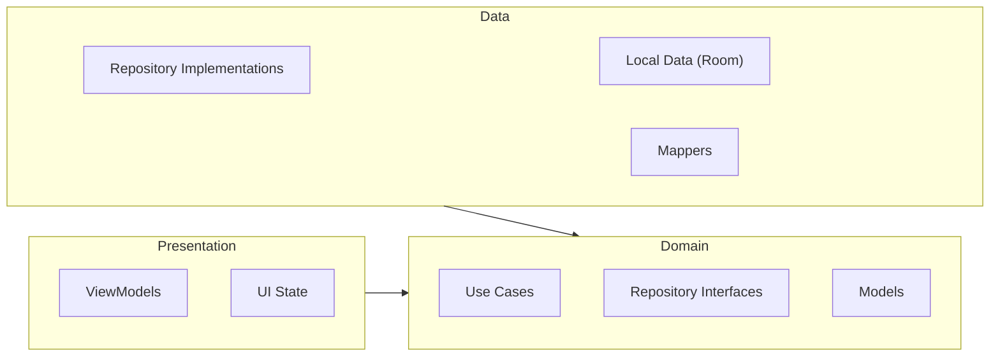

This is a Kotlin Multiplatform project targeting Android, iOS.

* [/iosApp](./iosApp/iosApp) contains an iOS application. Even if you’re sharing your UI with Compose Multiplatform,
  you need this entry point for your iOS app. This is also where you should add SwiftUI code for your project.

* [/shared](./shared/src) is for code that will be shared across your Compose Multiplatform applications.
  It contains several subfolders:
  - [commonMain](./shared/src/commonMain/kotlin) is for code that’s common for all targets.
  - Other folders are for Kotlin code that will be compiled for only the platform indicated in the folder name.
    For example, if you want to use Apple’s CoreCrypto for the iOS part of your Kotlin app,
    the [iosMain](./shared/src/iosMain/kotlin) folder would be the right place for such calls.
    Similarly, if you want to edit the Desktop (JVM) specific part, the [jvmMain](./shared/src/jvmMain/kotlin)
    folder is the appropriate location.

### UI Tree

Visual representation of the screen and component hierarchy:

```text
ParallaxScreen
└── Box                          (fillMaxSize)
    ├── Column                   (fillMaxSize, verticalScroll, statusBarsPadding, navigationBarsPadding, clickable)
    │   ├── Box                  (parallax header wrapper, graphicsLayer)
    │   │   └── Image            (header_dark / header_light)
    │   │
    │   └── Column               (main content, padding 16.dp, spacedBy 16.dp)
    │       ├── Box              (card: surface bg, border, RoundedCornerShape 12.dp)
    │       │   └── WeightConverter
    │       │       └── Column   (padding 16.dp)
    │       │           ├── Text ("Converter:")
    │       │           ├── Spacer
    │       │           ├── Row
    │       │           │   ├── CustomNumericInput   ← lb input
    │       │           │   ├── Text (" lb")
    │       │           │   ├── Text (" = ")
    │       │           │   ├── CustomNumericInput   ← kg input
    │       │           │   └── Text (" kg")
    │       │           ├── Spacer
    │       │           └── Button ("Reset")
    │       │
    │       └── Box              (card: surface bg, border, RoundedCornerShape 12.dp)
    │           └── OneRepMaxCalculator
    │               └── Column   (padding 16.dp, clickable)
    │                   ├── Text ("1RM calculator")
    │                   ├── Spacer
    │                   ├── Row  (weight input and unit switch)
    │                   │   ├── CustomNumericInput
    │                   │   ├── Spacer
    │                   │   ├── Text ("lb")
    │                   │   ├── Switch (unit toggle)
    │                   │   └── Text ("kg")
    │                   ├── Spacer
    │                   ├── Row  (reps control)
    │                   │   ├── CalculatorButton ("-")
    │                   │   ├── Box (reps display)
    │                   │   └── CalculatorButton ("+")
    │                   ├── Spacer
    │                   ├── Row  (record result)
    │                   │   ├── Text ("Record weight:")
    │                   │   └── Text (result display)
    │                   ├── Spacer
    │                   └── Button ("Reset")
    │
    └── Box                      (top-end: Settings button wrapper)
        ├── IconButton           (Settings icon)
        └── DropdownMenu
            ├── DropdownMenuItem ("Formulas")
            └── DropdownMenuItem ("About")

FormulaSelectionScreen
└── Scaffold
    ├── TopAppBar                ("1RM Formulas", Back button)
    └── Box                      (content wrapper)
        ├── CircularProgressIndicator (if loading)
        └── LazyColumn           (formulas list)
            └── Row              (formula selection item)
                ├── Checkbox
                └── Text         (formula name)

AboutScreen
└── Scaffold
    ├── TopAppBar                ("About Max Lift", Back button)
    └── Column                   (scrollable info content)
        ├── Text                 (description)
        ├── AboutSection         (Convert weights)
        ├── AboutSection         (Estimate 1RM)
        ├── AboutSection         (Trusted formulas)
        ├── AboutSection         (Built for lifters)
        └── Text                 (download call to action)
```

### Application Architecture

The project follows Clean Architecture principles, divided into three main layers:



#### Layer Details

```text
Application Architecture
├── Presentation Layer           (Depends on Domain)
│   ├── ViewModels               (Manages UI state and handle events)
│   │   ├── CalculatorViewModel
│   │   └── FormulaSelectionViewModel
│   └── UI State                 (Reactive state for Compose)
│       ├── CalculatorUiState
│       └── FormulaSelectionState
│
├── Domain Layer                 (Pure Kotlin, no dependencies)
│   ├── Models                   (Business objects)
│   │   ├── CalculatorState
│   │   ├── FormulaSelection
│   │   └── FormulaType
│   ├── Repository Interfaces    (Defined as interfaces)
│   │   ├── CalculatorRepository
│   │   └── FormulaRepository
│   └── Use Cases                (Single-purpose business logic)
│       ├── GetCalculatorStateUseCase
│       ├── SaveCalculatorStateUseCase
│       ├── GetAllFormulasUseCase
│       ├── GetSelectedFormulasUseCase
│       └── ToggleFormulaSelectionUseCase
│
└── Data Layer                   (Depends on Domain)
    ├── Repository Impls         (Implements Domain interfaces)
    │   ├── CalculatorRepositoryImpl
    │   └── FormulaRepositoryImpl
    ├── Local Data (Room)        (Persistence with Jetpack Room)
    │   ├── AppDatabase
    │   ├── CalculatorStateDao / FormulaDao
    │   └── CalculatorStateEntity / FormulaEntity
    └── Mappers                  (Converts between Entities and Domain models)
        ├── CalculatorMapper
        └── FormulaMapper
```

### Running the apps

Use the run configurations provided by the run widget in your IDE's toolbar. You can also use these commands and options:

- Android app: `./gradlew :androidApp:assembleDebug`
- iOS app: open the [/iosApp](./iosApp) directory in Xcode and run it from there.

### Running tests

Use the run button in your IDE's editor gutter, or run tests using Gradle tasks:

- Android tests: `./gradlew :shared:testAndroidHostTest`
- iOS tests: `./gradlew :shared:iosSimulatorArm64Test`

---

Learn more about [Kotlin Multiplatform](https://www.jetbrains.com/help/kotlin-multiplatform-dev/get-started.html)…